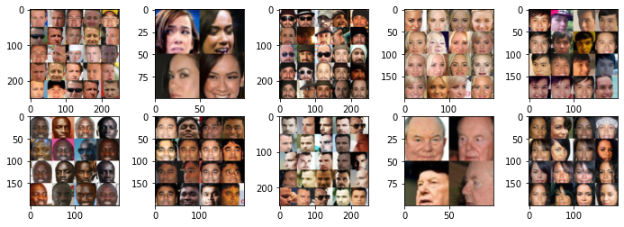

# Facial recognition with ResNet50 trained in Siamese Neural Network configuration (SNN)

This repository contains a small facial recognition system using ResNet50 architecture trained in Siamese Neural Network (SNN) configuration. In the repository there are some python notebooks that can run on Google Colab or on a computer with a good GPU.

## Siamese Neural Networks (SNN)

Siamese Neural Network (SNN) is an architecture proposed by Bromley et al in 1994. The initial objective of this architecture was to create signature recognizers, but the possibilities of this architecture are wide. In general, it is an option to solve pattern recognition problems where there is no closed and pre-defined set of classes.

A Siamese Neural Network (SNN) has two identical neural sub-networks (siamese twins) that we call encoders. Encoders work as non-linear functions that transform an input tensor into a feature vector. In this work, the input tensors are 3-channel 80x80 images, and the feature vectors have 100 dimensions (features). The trained encoder is later used in conjunction with other simpler classifiers (such as KNN, K-means or DBSCAN) to create a face recognizer.

## ResNet50 architecture

ResNet50 is an artificial neural network convolutional architecture composed of residual convolutional blocks, initially proposed by K. He et al in 2016.

|  |
|:--:|
| **Fig. 1 - Identity and Convolution Blocks in ResNet.** (Source: https://www.analyticsvidhya.com/blog/2021/08/how-to-code-your-resnet-from-scratch-in-tensorflow/)  |

In this work, the ResNet50 architecture was used as the encoder base, just adding a linear dense layer to the output to generate the feature vectors.

## CelebFaces Attributes Dataset (CelebA)

The data used in this project comes from the CelebA public dataset.

The CelebA dataset (Liu et al) contains photos of human faces with some attributes. In this project, cropped photos of faces were used, and the attributes used were people's identification (each person is identified by a natural number in the dataset).

|  |
|:--:|
|**Fig. 2 - Some faces from the CelebA dataset**|

## Notebooks

1. [training](training.ipynb) - In this notebook, there is a more detailed explanation about the functioning of a SNN and there is also the SNN training code used here.

## References

* Bromley, J., Bentz, J., Bottou, L., Guyon, I., Lecun, Y., Moore, C., … Shah, R. (08 1993). Signature Verification using a “Siamese” Time Delay Neural Network. International Journal of Pattern Recognition and Artificial Intelligence, 7, 25. doi:10.1142/S0218001493000339
* Lian, Z., Li, Y., Tao, J., & Huang, J. (2018). Speech Emotion Recognition via Contrastive Loss under Siamese Networks. Proceedings of the Joint Workshop of the 4th Workshop on Affective Social Multimedia Computing and First Multi-Modal Affective Computing of Large-Scale Multimedia Data, 21–26. Presented at the Seoul, Republic of Korea. doi:10.1145/3267935.3267946
* K. He, X. Zhang, S. Ren and J. Sun, "Deep Residual Learning for Image Recognition," 2016 IEEE Conference on Computer Vision and Pattern Recognition (CVPR), 2016, pp. 770-778, doi: 10.1109/CVPR.2016.90.
* Liu, Z., Luo, P., Wang, X., & Tang, X. (2015, Desember). Deep Learning Face Attributes in the Wild. Proceedings of International Conference on Computer Vision (ICCV).